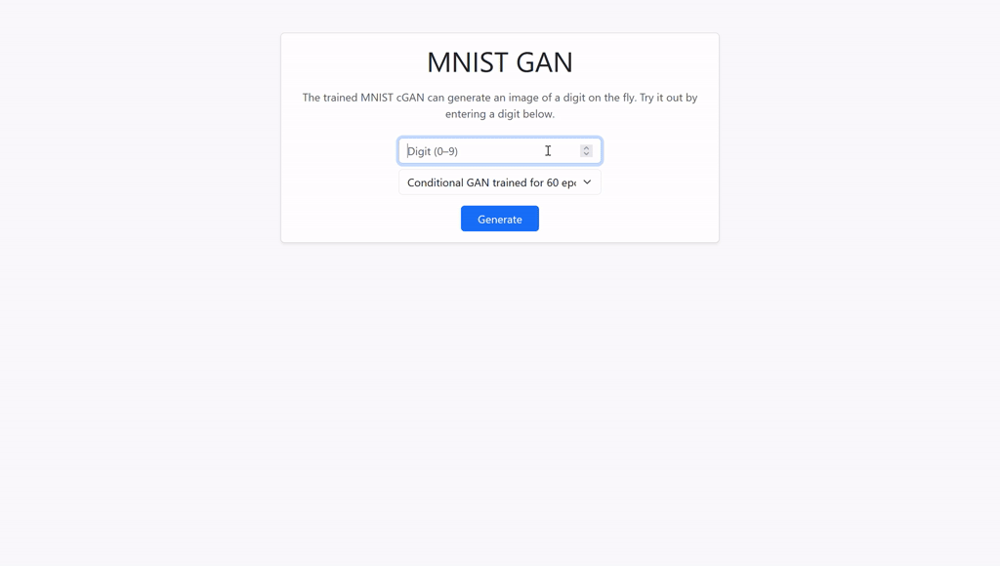

<!-- Custom Animated Numbers-Themed Header Banner -->
<div align="center">
  
  <br/><br/>
  <a href="https://git.io/typing-svg">
    
  </a>
  <br/>

  <p align="center">
    
    
    
    
    
    
  </p>

  <p align="center">
    A conditional generative adversarial network (cGAN) built in PyTorch that allows deterministic, targeted synthesis of handwritten digits (0–9). Includes an interactive Flask web UI to visualize batch sampling across different training checkpoints (epochs 10 to 100).
  </p>

  <p align="center">
    
  </p>
</div>

---

### 📑 Table of Contents

- [🎯 Aim of the Project](#-aim-of-the-project)
- [✨ Key Features](#-key-features)
- [📐 Model Architecture & Formulation](#-model-architecture--formulation)
  - [cGAN Objective](#cgan-objective)
  - [Generator Architecture](#generator-architecture)
  - [Discriminator Architecture](#discriminator-architecture)
- [⏳ Training Progression & Checkpoints](#-training-progression--checkpoints)
- [📂 Project Structure](#-project-structure)
- [🚀 Quickstart & Installation](#-quickstart--installation)
  - [1. Clone & Set Up Environment](#1-clone--set-up-environment)
  - [2. Install Dependencies](#2-install-dependencies)
  - [3. Run Interactive Web UI](#3-run-interactive-web-ui)
  - [4. Programmatic Inference](#4-programmatic-inference)
- [💻 Technical Tooling](#-technical-tooling)
- [📄 License](#-license)

---

### 🎯 Aim of the Project

Standard vanilla GANs map noise $z \sim p_z(z)$ directly to the data distribution $p_{data}(x)$, but offer **zero control** over which specific class is produced during inference—generating arbitrary digits at random.

The aim of this project is to:
1. **Implement Conditional Generative Modeling from First Principles**: Extend the standard minimax GAN formulation to condition both the generator and discriminator on explicit class metadata $y \in \{0, 1, \dots, 9\}$.
2. **Enable Controllable Digit Synthesis**: Allow the user to specify the desired digit label and generate realistic, diverse $28 \times 28$ handwritten variations on demand.
3. **Analyze Generative Convergence Across Epochs**: Track and compare output fidelity across training checkpoints saved every 10 epochs (from early noisy approximations at epoch 10 to sharp, well-formed digits at epoch 100).
4. **Deliver a Turnkey Interactive Interface**: Bridge model research with deployment via a lightweight Flask and Bootstrap application for real-time batch grid generation.

---

### ✨ Key Features

<table>
  <tr>
    <td width="50%" valign="top">
      <h4>🎯 Controllable Class Synthesis</h4>
      <p>Target any specific digit class from <code>0</code> through <code>9</code>. Class labels are one-hot encoded and fused with latent noise vectors to guide generation deterministically.</p>
      <ul>
        <li>One-hot label conditioning vector ($d=10$)</li>
        <li>64-dimensional latent Gaussian noise prior</li>
        <li>Guaranteed label alignment during sampling</li>
      </ul>
    </td>
    <td width="50%" valign="top">
      <h4>⚡ Interactive Flask Web Application</h4>
      <p>A responsive Bootstrap 5 web frontend that enables instant generation and side-by-side exploration directly inside your browser.</p>
      <ul>
        <li>Select digit class via intuitive numeric input</li>
        <li>Switch between 10 model epoch checkpoints dynamically</li>
        <li>Renders a normalized 8&times;8 image grid (64 samples) on the fly</li>
      </ul>
    </td>
  </tr>
  <tr>
    <td width="50%" valign="top">
      <h4>📈 Multi-Checkpoint Comparison</h4>
      <p>Ten saved model checkpoints spanning epoch 10 to 100 allow direct inspection of how the adversarial equilibrium stabilizes over training time.</p>
      <ul>
        <li>Pre-trained weights saved with optimizer states and metadata</li>
        <li>Observe artifact suppression and digit stroke refinement</li>
        <li>Inspect mode coverage and sample diversity per epoch</li>
      </ul>
    </td>
    <td width="50%" valign="top">
      <h4>🧼 Modular & Lightweight Codebase</h4>
      <p>Designed with clean separation of concerns across network definitions, configuration management, and server routing.</p>
      <ul>
        <li>Self-contained PyTorch module in <code>gan.py</code></li>
        <li>Centralized model catalog and checkpoint registry in <code>config.py</code></li>
        <li>Zero heavy frontend dependencies—pure HTML5 + Bootstrap</li>
      </ul>
    </td>
  </tr>
</table>

---

### 📐 Model Architecture & Formulation

#### cGAN Objective

The Conditional GAN framework formulates a two-player zero-sum game conditioned on class label $y$:

$$\min_G \max_D V(D, G) = \mathbb{E}_{x \sim p_{\text{data}}(x)}\Big[\log D(x \mid y)\Big] + \mathbb{E}_{z \sim p_z(z)}\Big[\log \big(1 - D(G(z \mid y) \mid y)\big)\Big]$$

* The **Discriminator** $D(x \mid y)$ maximizes the probability of assigning the correct label to both real training images and synthetic images conditioned on class $y$.
* The **Generator** $G(z \mid y)$ minimizes $\log(1 - D(G(z \mid y) \mid y))$ (trained with non-saturating $\log D$ heuristic) to deceive the discriminator into classifying generated digits as real.

```
                      +-------------------+
  z ~ N(0, I) [64] -->|                   |
                      |  Generator G(z,y) | --> Synthetic Digit [1, 28, 28]
  Class y [10]     -->|                   |              |
  (One-Hot)           +-------------------+              v
                                               +----------------------+
  Real Digit [1, 28, 28] -------------------->|                      |
                                               | Discriminator D(x,y) | --> Real / Fake [0, 1]
  Class y [10] (One-Hot) -------------------->|                      |
                                               +----------------------+
```

#### Generator Architecture

The generator accepts latent noise concatenated with the one-hot target class vector ($64 + 10 = 74$ dimensions) and maps it into image space ($784 = 1 \times 28 \times 28$):

| Layer | Type | Input Dim | Output Dim | Activation |
| :--- | :--- | :--- | :--- | :--- |
| **Input** | Concat $(z, y)$ | — | $74$ | — |
| **Linear 1** | `nn.Linear` | $74$ | $256$ | `LeakyReLU(0.2)` |
| **Linear 2** | `nn.Linear` | $256$ | $512$ | `LeakyReLU(0.2)` |
| **Output** | `nn.Linear` | $512$ | $784$ | `Tanh()` $\rightarrow [-1, 1]$ |

*Output is reshaped to $(B, 1, 28, 28)$ for visualization and grid assembly.*

#### Discriminator Architecture

The discriminator takes flattened image pixels concatenated with the one-hot class vector ($784 + 10 = 794$ dimensions) and predicts validity:

| Layer | Type | Input Dim | Output Dim | Activation |
| :--- | :--- | :--- | :--- | :--- |
| **Input** | Concat $(x, y)$ | — | $794$ | — |
| **Linear 1** | `nn.Linear` | $794$ | $256$ | `LeakyReLU(0.2)` |
| **Linear 2** | `nn.Linear` | $256$ | $128$ | `LeakyReLU(0.2)` |
| **Output** | `nn.Linear` | $128$ | $1$ | `Sigmoid()` $\rightarrow [0, 1]$ |

---

### ⏳ Training Progression & Checkpoints

All model checkpoints are stored under `models/` with full state dictionaries for both Generator and Discriminator:

<details open>
  <summary><b>Available Checkpoints (Click to toggle)</b></summary>
  <br/>

| Checkpoint Name | Epoch | Loss / Dynamics Stage | Visual Characteristics |
| :--- | :---: | :--- | :--- |
| `mnist_cgan_v2_e10.pth` | 10 | Early convergence | Coarse outlines, high background noise, faint digits |
| `mnist_cgan_v2_e20.pth` | 20 | Digit formation | Basic character shapes emerge; fuzzy boundaries |
| `mnist_cgan_v2_e30.pth` | 30 | Contrast sharpening | Clear stroke paths; distinct separation from background |
| `mnist_cgan_v2_e40.pth` | 40 | Stroke stabilization | Reduced speckle artifacts; stable loops and stems |
| `mnist_cgan_v2_e50.pth` | 50 | Structural refinement | Consistent class identity across all digits 0–9 |
| `mnist_cgan_v2_e60.pth` | 60 | Default production checkpoint | Crisp foreground-background contrast; excellent diversity |
| `mnist_cgan_v2_e70.pth` | 70 | Edge sharpening | Fine-tuned curves, reduced stroke blurring |
| `mnist_cgan_v2_e80.pth` | 80 | Stable equilibrium | High fidelity; consistent thickness variations |
| `mnist_cgan_v2_e90.pth` | 90 | Advanced convergence | Sharp handwriting variations and diverse slant angles |
| `mnist_cgan_v2_e100.pth` | 100 | Fully converged | Near-ground-truth realism across batch samples |

</details>

---

### 📂 Project Structure

```text
MNISTGans/
│
├── assets/
│   └── demo.gif                # Animated preview of the interactive web app
│
├── models/                     # Saved model checkpoints across training epochs
│   ├── mnist_cgan_v2_e10.pth
│   ├── ...
│   ├── mnist_cgan_v2_e60.pth   # Default evaluation model
│   └── mnist_cgan_v2_e100.pth
│
├── runs/                       # TensorBoard event logs
│   └── GAN_MNIST/              # Generator and discriminator training curves
│
├── static/
│   └── output.png              # Generated 8x8 batch output image grid
│
├── templates/
│   └── index.html              # Responsive Bootstrap 5 UI template
│
├── app.py                      # Flask application and batch generation server
├── config.py                   # Model registry and runtime parameters
├── gan.py                      # PyTorch Generator, Discriminator, and cGAN class
├── requirements.txt            # Python dependencies
└── README.md                   # Project documentation
```

---

### 🚀 Quickstart & Installation

#### 1. Clone & Set Up Environment

```bash
git clone https://github.com/slyofzero/MNISTGans.git
cd MNISTGans

# Create a virtual environment
python -m venv .venv

# Activate the virtual environment
# Windows (PowerShell):
.\.venv\Scripts\Activate.ps1
# Linux / macOS:
source .venv/bin/activate
```

#### 2. Install Dependencies

```bash
pip install -r requirements.txt
```

#### 3. Run Interactive Web UI

Launch the Flask development server:

```bash
python app.py
```

Open your browser and navigate to:
```text
http://127.0.0.1:5000
```

* Select your target digit (`0` – `9`).
* Choose a checkpoint (e.g., `Conditional GAN trained for 60 epochs`).
* Click **Generate** to sample a batch of 64 digits stitched into a grid.

#### 4. Programmatic Inference

You can also use the generator directly in Python without starting the web server:

```python
import torch
import torchvision
from gan import MNIST_cGAN

# 1. Initialize cGAN model
z_dim = 64
classes_count = 10
img_dim = 28 * 28
batch_size = 64
target_digit = 7

gan = MNIST_cGAN(z_dim=z_dim, img_dim=img_dim, targets_dim=classes_count)
gan.load_save(save_folder="./models", save_name="mnist_cgan_v2_e60")

# 2. Sample latent vectors and condition on target digit
with torch.no_grad():
    gan.generator.eval()
    noise = MNIST_cGAN.generate_noise(batch_size, z_dim)
    labels = torch.full((batch_size,), target_digit)
    noise_labels = MNIST_cGAN.encode_labels(labels, classes_count)
    noise_injected = torch.cat([noise, noise_labels], dim=1)

    # 3. Generate and reshape
    fake_images = gan.generator(noise_injected).reshape(-1, 1, 28, 28).float()
    
    # 4. Save 8x8 visualization grid
    grid = torchvision.utils.make_grid(fake_images, normalize=True)
    torchvision.utils.save_image(grid, "sample_digits.png")
    print(f"Saved 64 generated samples of digit '{target_digit}' to sample_digits.png")
```

---

### 💻 Technical Tooling

<p align="left">
  <!-- Core ML / Frameworks -->
  
  
  
  
  
  
  <br/>
  <!-- Languages & Platform -->
  
  
  
</p>

---

### 📄 License

This repository is distributed under the [MIT License](LICENSE). Feel free to use, modify, and build upon this code for research or educational purposes.

---

<div align="center">
  <p>
    <b>Ishan Shishodiya</b> &bull; 
    <a href="https://github.com/slyofzero">GitHub</a> &bull; 
    <a href="https://www.linkedin.com/in/ishan-shishodiya-5100061b9/">LinkedIn</a> &bull; 
    <a href="mailto:sly.of.zero@gmail.com">Email</a>
  </p>
  <i>"Curious about how machines learn structure, not just patterns."</i>
</div>
